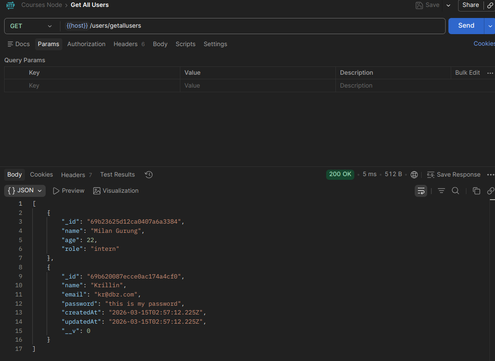
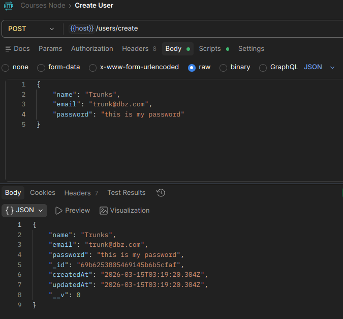
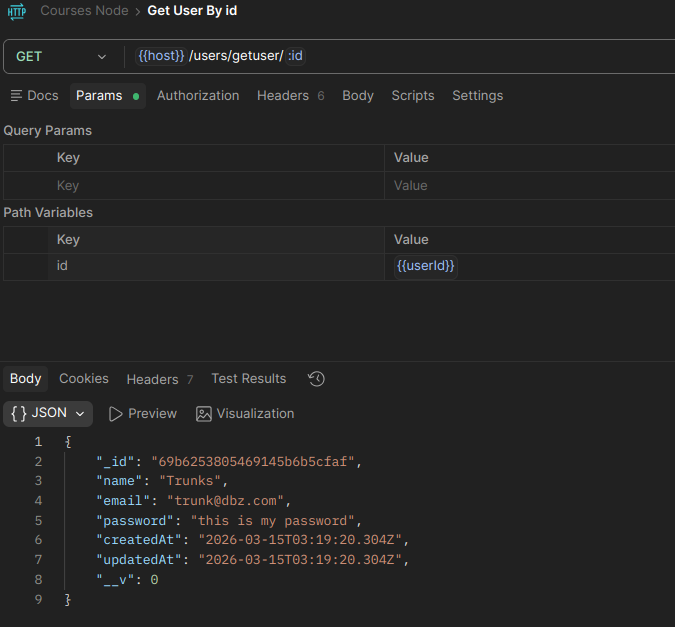
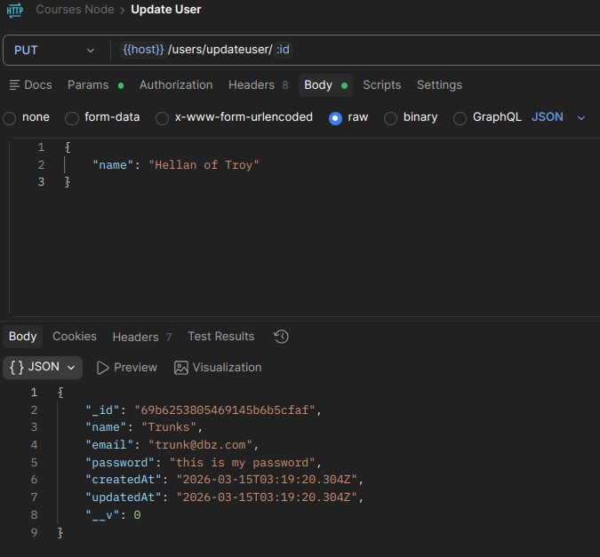
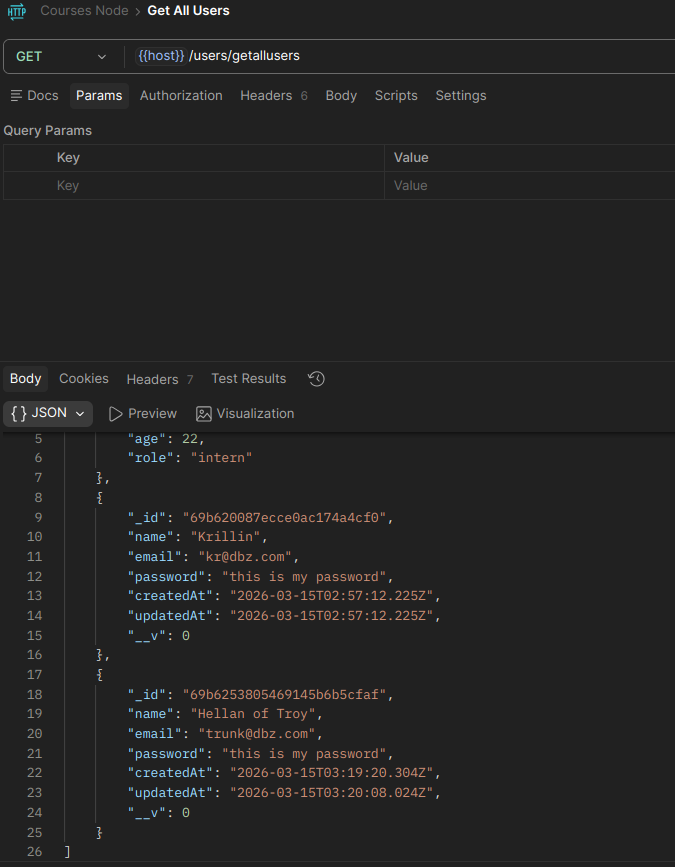
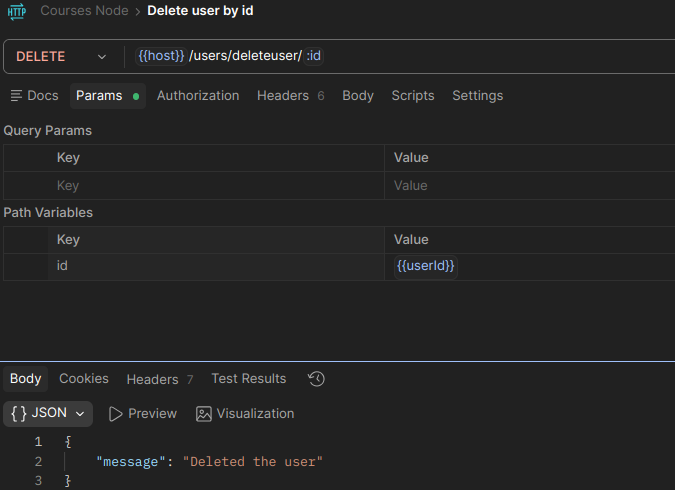

# Course Management System Backend
A nodejs project for handling courses.

## User CRUD
Postman Screenshots of User CRUD operations

### Get all users

### Create User

### Get User By Id

### Update User

### Delete User
1) Get Before Delete

2) Delete User

3) Get After Delete
