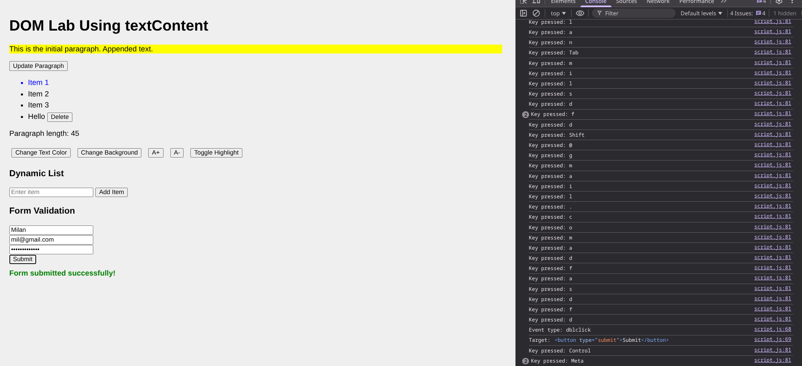

# Lab Work: Document Object Model (DOM) Model
Lab work demonstrating knowledge and understanding of DOM manipulation using JavaScript.

## Features
- DOM selection
- Change text, content
- Change elememt style
- Event handling
- Form handling
- Dynamic element creation and removal

## Screenshots

