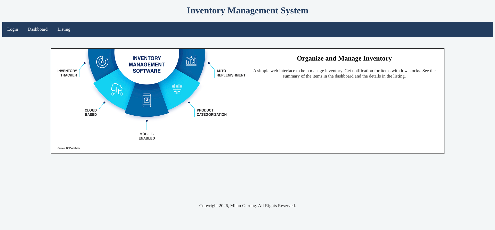
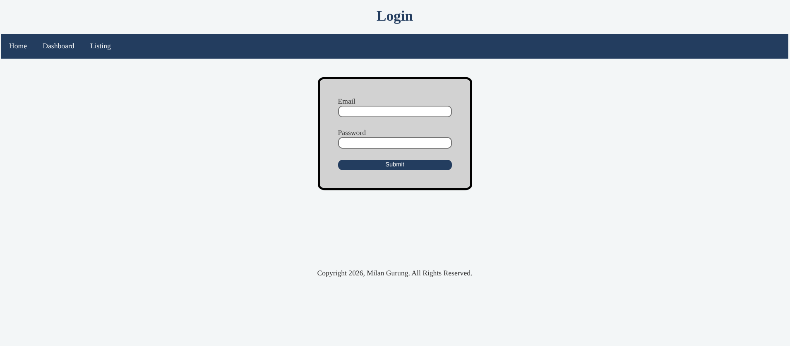
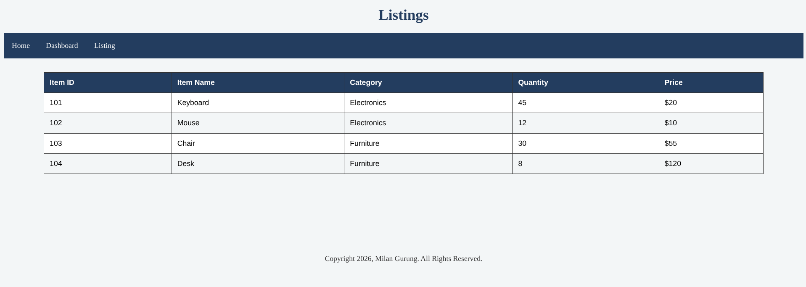

# Lab Assignment 3: Inventory Management System
The assignment asks the students to design a Static Management System Web Interface Using HTML and CSS. The assignment doesn't require a backend and asks the students to use the following tags approprately:
* Headings (h1 to h6)
* Paragraphs (p)
* Lists (ul, ol, li)
* Tables (table, thead, tbody, tr, th, td)
* Forms (form, input, label, button)
* Semantic tags (header, nav, section, article, footer)
* Anchor tags (a)
* Images (img)

## Running
Use `Live Server` to host the pages locally.

## List of Pages:
* Home Page (index.html)
    
* Login Page
    
* Dashboard
    
* Listing
    
