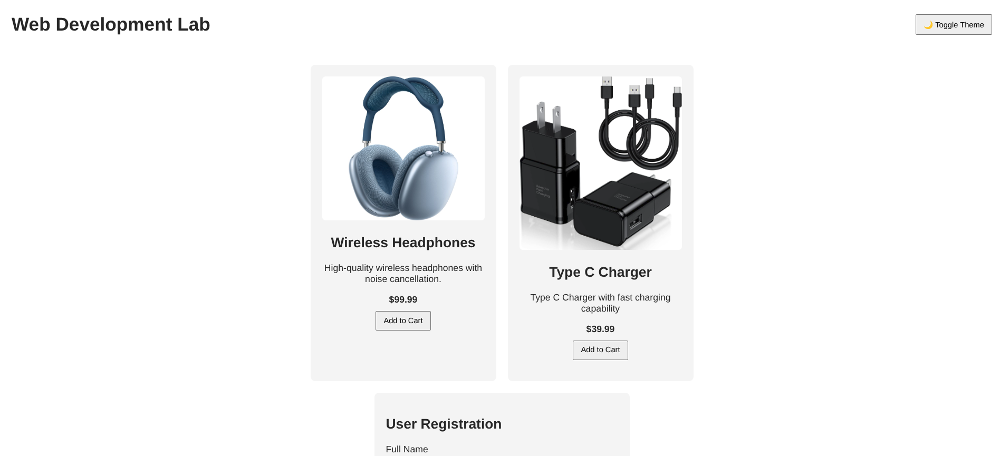
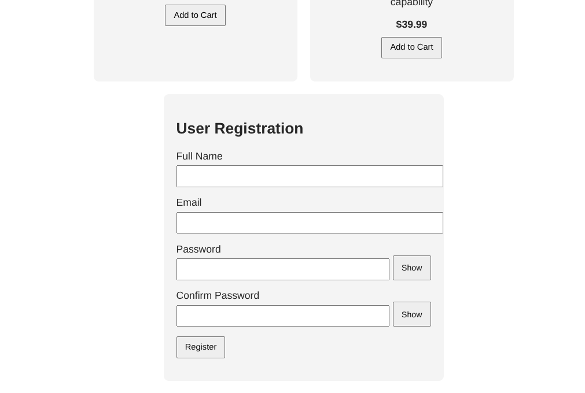
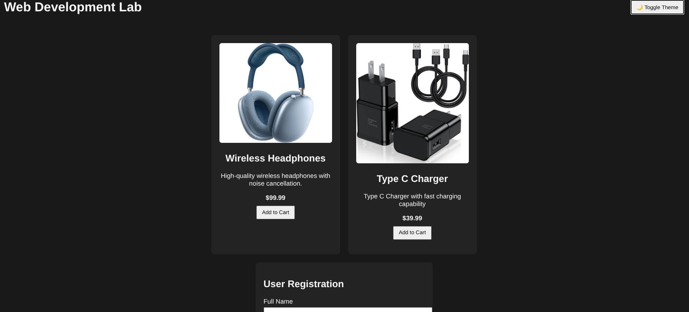
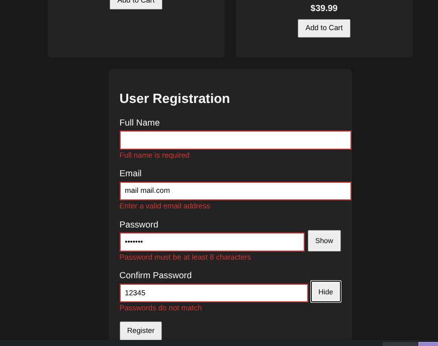

# Interactive Product Card and User Registration Form

## Description
This project is a responsive web page developed using pure HTML, CSS, and JavaScript. It includes an interactive product card and a user registration form with validation, error handling, theme switching, and accessibility-focused UI behavior.

##  Features Implemented
- Product card with image fallback handling
- Add to Cart interaction with success message
- User registration form with client-side validation
- Real-time validation on blur and submit
- Password show/hide toggle
- Clear error messages and input highlighting
- Dark mode and light mode with localStorage persistence
- Fully responsive and clean UI

## Technologies Used
- HTML5
- CSS3
- Vanilla JavaScript (No external libraries)

## Screenshots

